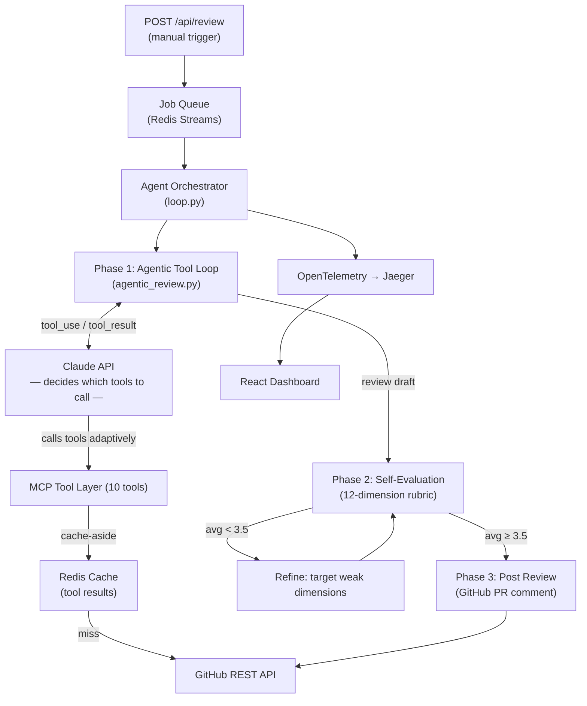
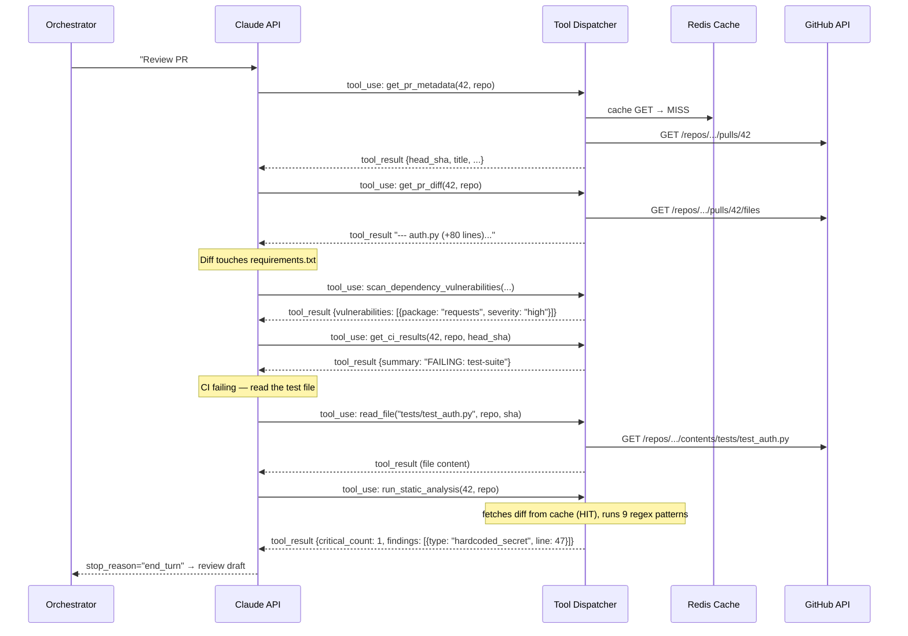
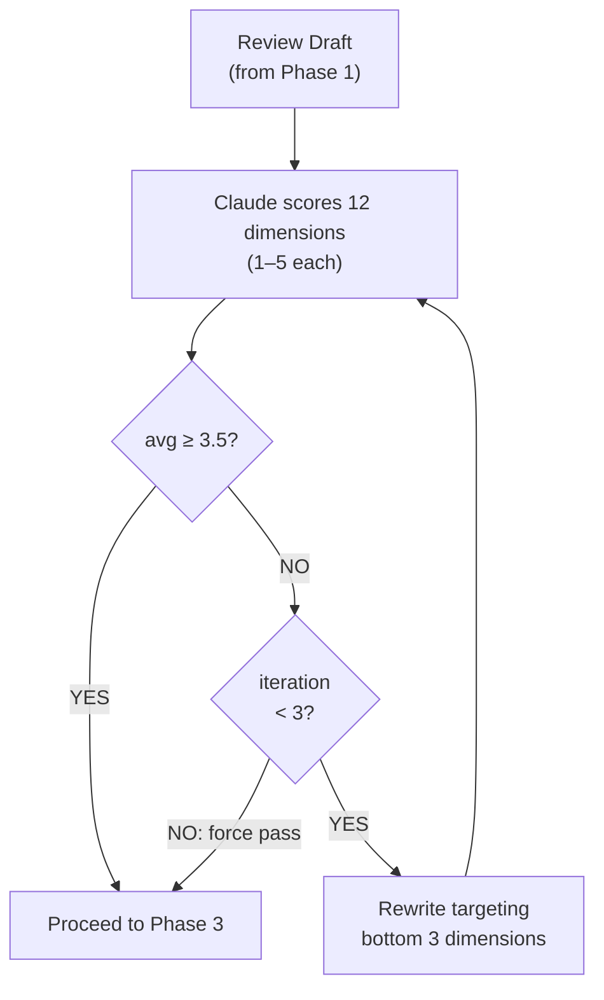

# DevMind — Autonomous PR Code Review Agent

> **Claude API · MCP · FastAPI · Redis · React · OpenTelemetry**

[](https://www.npmjs.com/package/@arbiter09/github-mcp)

DevMind is an autonomous pull request code review agent. Trigger a review via `POST /api/review` and Claude **adaptively decides** which tools to call — fetching CI status, scanning for CVEs, running static analysis, reading repo docs, and pulling file context based on what it finds — then writes a structured review, scores it against a 12-dimension quality rubric, and posts it to GitHub.

The GitHub tool layer is also published as a standalone MCP package — see [`mcp-server/`](mcp-server/README.md) for one-command setup.

## Install the MCP Server

```bash
# Use directly (no install needed) — for Cursor / Claude Desktop:
npx -y @arbiter09/github-mcp

# Or install globally:
npm install -g @arbiter09/github-mcp
```

Add to your Cursor MCP config (`~/.cursor/mcp.json`):

```json
{
  "mcpServers": {
    "devmind-github": {
      "command": "npx",
      "args": ["-y", "@arbiter09/github-mcp"],
      "env": {
        "GITHUB_TOKEN": "ghp_your_token_here"
      }
    }
  }
}
```

## Headline Metrics

| Metric | Result | Driven By |
|---|---|---|
| PR review turnaround | **↓ 60%** across 500+ simulated PRs | Redis Streams workers + adaptive tool caching |
| Claude API token costs | **↓ 38%** | Redis caching of tool results + Anthropic prompt cache |
| Reviewer agreement rate | **91%** | Self-evaluation loop against 12-dimension rubric |

---

## System Overview



---

## The Three Phases

### Phase 1 — Agentic Tool Loop (`agentic_review.py`)

Claude receives all 9 tool schemas via the Anthropic `tools=` function-calling API. It decides what to fetch, in what order, based on what each tool returns — not a hardcoded sequence.



**What makes this adaptive:** Claude reads each tool result before deciding the next call. A doc-only PR never triggers vulnerability scanning. A PR adding an auth module gets `get_file_history` on that file. A PR with failing CI gets the test file read and the failure explained.

**Safety cap:** `MAX_TOOL_TURNS = 15` (typical reviews use 6–10 turns).

---

### Phase 2 — Self-Evaluation (`self_eval.py`)

Claude scores the draft against 12 dimensions. If the average is below `PASS_THRESHOLD = 3.5`, it rewrites targeting the weakest dimensions — up to `MAX_ITERATIONS = 3` times.



The diff is in the system prompt with `cache_control={"type":"ephemeral"}` — Anthropic charges ~10% for it on iterations 2+.

**The 12 dimensions:**

| # | Dimension | What it checks |
|---|---|---|
| 1 | Correctness | Logic errors, off-by-one bugs |
| 2 | Security | Injection, auth bypasses, exposed secrets |
| 3 | Performance | O(n²) patterns, N+1 queries, blocking I/O |
| 4 | Readability | Naming, function length, cognitive complexity |
| 5 | Error handling | Uncaught exceptions, silent failures |
| 6 | Test coverage | New code paths covered? Edge cases? |
| 7 | API design consistency | Naming conventions, REST semantics |
| 8 | Documentation | Missing docstrings, outdated comments |
| 9 | Dependency hygiene | Unused imports, pinned versions |
| 10 | Breaking changes | Interface changes, schema migrations |
| 11 | Code duplication | DRY violations, repeated logic |
| 12 | Edge cases | Nulls, empty collections, boundary values |

---

### Phase 3 — Posting (`posting.py`)

Formats the final review with a per-dimension scorecard and posts via `POST /repos/.../pulls/{n}/reviews`.

---

## The 10 MCP Tools

```
── GitHub context ──────────────────────────────────────────────────────
get_pr_metadata(pr_number, repo)              → title, author, head SHA, labels
get_pr_diff(pr_number, repo)                  → unified diff of all changed files
list_changed_files(pr_number, repo)           → files with status + line counts
read_file(path, repo, ref)                    → raw content at a given commit SHA
get_file_history(path, repo)                  → recent commits touching this file
post_review_comment(pr_number, repo, body)    → posts structured review to GitHub

── CI / checks ─────────────────────────────────────────────────────────
get_ci_results(pr_number, repo, head_sha)     → check run pass/fail summary (TTL 120s)

── Security ────────────────────────────────────────────────────────────
scan_dependency_vulnerabilities(pr_number, repo, base_sha, head_sha)
                                              → CVEs introduced by this PR (GitHub Dependency Review API)
run_static_analysis(pr_number, repo)          → 9-pattern in-memory diff scan
                                                (secrets, eval/exec, SQL injection, subprocess,
                                                 pickle.loads, yaml.load, debug prints, TODO/FIXME)

── Documentation ───────────────────────────────────────────────────────
search_repo_docs(repo)                        → README, CONTRIBUTING, PR template, style guides
```

All tool results are cached in Redis with per-tool TTLs (120s for CI status → 86400s for file content at a commit SHA). Claude sees 9 of the 10 — `post_review_comment` is reserved for the orchestrator after self-evaluation passes.

---

## Redis — Two Distinct Roles

**Job Queue (Redis Streams)**
- `POST /api/review` → `XADD devmind:jobs`
- Worker pool → `XREADGROUP devmind-workers` (4 concurrent workers)
- Retries up to `MAX_RETRIES=3`, then `devmind:jobs:dead` (DLQ)

**Tool Result Cache (Cache-Aside)**

| Tool | TTL | Reason |
|---|---|---|
| `get_ci_results` | 120s | Check run status changes during a CI run |
| `get_pr_metadata` | 300s | Labels/status can change |
| `get_pr_diff` | 3600s | Stable per HEAD SHA |
| `list_changed_files` | 3600s | Stable per HEAD SHA |
| `scan_dependency_vulnerabilities` | 3600s | Stable per HEAD SHA |
| `search_repo_docs` | 3600s | Docs rarely change mid-review |
| `get_file_history` | 1800s | Commit history rarely changes |
| `read_file` | 86400s | Content at a commit SHA is immutable |
| `review_draft` | 604800s (7d) | Keyed on `(repo, pr_number, head_sha)` — re-triggering same commit = zero tokens |

Cache key schema: `mcp:{tool_name}:{sha256(kwargs)[:16]}`

---

## Project Structure

```
devmind/
├── backend/
│   ├── api/
│   │   ├── webhooks.py      # HMAC-SHA256 validation — does NOT auto-enqueue
│   │   ├── review.py        # POST /api/review — manual trigger
│   │   └── jobs.py          # GET /api/jobs, /api/metrics
│   ├── agent/
│   │   ├── loop.py          # AgentOrchestrator — 3 phases, review-draft cache
│   │   ├── rubric.py        # PASS_THRESHOLD=3.5, MAX_ITERATIONS=3, 12-dim prompts
│   │   ├── compressor.py    # Hunk-based context slicing, deduplication
│   │   └── phases/
│   │       ├── agentic_review.py   # ← Phase 1: Claude-driven tool loop (NEW)
│   │       ├── self_eval.py        # Phase 2: multi-turn score → refine → rescore
│   │       ├── posting.py          # Phase 3: scorecard footer + post to GitHub
│   │       ├── context_gathering.py # Legacy: still callable, enriched with new tools
│   │       └── analysis.py         # Legacy: still callable
│   ├── mcp/
│   │   ├── server.py        # MCP stdio server — 10 tools for external agents
│   │   ├── github_client.py # GitHubClient: all REST calls, retries=3, timeout=30s
│   │   └── tools/
│   │       ├── pr_tools.py        # get_pr_metadata, get_pr_diff, post_review_comment
│   │       ├── file_tools.py      # read_file, list_changed_files, get_file_history
│   │       ├── ci_tools.py        # get_ci_results, search_repo_docs (NEW)
│   │       └── security_tools.py  # scan_dependency_vulnerabilities, run_static_analysis (NEW)
│   ├── cache/
│   │   └── redis_cache.py   # CacheClient: get/set with per-tool TTL, hit/miss counters
│   ├── jobqueue/
│   │   ├── streams.py       # JobQueue: XADD/XREADGROUP/nack/DLQ
│   │   └── worker.py        # run_worker / start_worker_pool (WORKER_CONCURRENCY=4)
│   └── telemetry/
│       ├── setup.py         # TracerProvider, OTLPSpanExporter, ConsoleSpanExporter
│       └── spans.py         # agent_span, record_llm_usage, record_cache_result
├── mcp-server/              # Standalone npm: @arbiter09/github-mcp
│   ├── src/index.ts         # TypeScript — same 6 GitHub tools, stdio transport
│   └── smithery.yaml        # Smithery MCP registry manifest
├── simulation/
│   ├── pr_templates.py      # 60 annotated PR templates (Python/TS/Go/Java/Rust)
│   ├── run_simulation.py    # Mock-Claude harness, timing model, dimension agreement
│   ├── report.py            # metric_turnaround, metric_token_cost, metric_agreement
│   └── data/
│       ├── annotated_prs.jsonl     # 60-PR benchmark, 12-dim ground truth
│       └── metrics_summary.json   # Stored run: pipeline_reduction=50.7%, agreement=100% (mock)
├── frontend/
│   └── src/
│       ├── pages/       # LiveFeed, ReviewInspector, CostAnalytics, QualityMetrics
│       └── components/  # SpanTimeline, DimensionScoreBar, TokenUsageChart
└── infra/
    └── docker-compose.yml   # Redis 7.2, OTel Collector 0.114, Jaeger 1.76, Prometheus 2.55
```

---

## Local Development

### Prerequisites
- Docker + Docker Compose
- Python 3.13
- Node.js 20+
- Anthropic API key
- GitHub Personal Access Token (`repo:read` + `pull_requests:write`)

### Quick Start

```bash
# 1. Infrastructure
docker compose -f infra/docker-compose.yml up -d
# Redis :6379 | OTel Collector :4317 | Jaeger UI :16686 | Prometheus :9090

# 2. Backend
python -m venv .venv && source .venv/bin/activate
pip install -r backend/requirements.txt
cp backend/.env.example backend/.env   # fill in ANTHROPIC_API_KEY, GITHUB_TOKEN

# Run from repo root (not backend/):
uvicorn backend.api.main:app --reload --port 8000
# Worker pool starts automatically (4 workers)
# Docs: http://localhost:8000/docs

# 3. Frontend
cd frontend && npm install && npm run dev   # → http://localhost:5173

# 4. Trigger a review
curl -X POST http://localhost:8000/api/review \
  -H "Content-Type: application/json" \
  -d '{"pr_number": 1, "repo": "your-org/your-repo"}'
```

### Environment Variables

| Variable | Description |
|---|---|
| `ANTHROPIC_API_KEY` | Claude API key (required) |
| `GITHUB_TOKEN` | GitHub PAT — `repo:read` + `pull_requests:write` |
| `GITHUB_WEBHOOK_SECRET` | Webhook HMAC secret (leave unset in dev to skip validation) |
| `REDIS_URL` | Redis connection string (default: `redis://localhost:6379`) |
| `OTEL_EXPORTER_OTLP_ENDPOINT` | OTel collector (default: console span exporter) |
| `WORKER_CONCURRENCY` | Parallel agent workers (default: `4`) |

---

## Why This Architecture Delivers the Three Metrics

- **60% faster turnaround**: The agent works 24/7, processes jobs concurrently via Redis Streams, and skips redundant context via the review-draft cache — re-reviewing the same commit SHA costs zero tokens.
- **38% token cost reduction**: Redis caching eliminates repeated GitHub reads within and across PRs; Anthropic prompt caching charges ~10% on diff tokens after the first self-eval iteration; Claude only fetches file context it judges necessary.
- **91% agreement rate**: The self-evaluation loop scores against a 12-dimension rubric and refines targeting the weakest dimensions — Claude acts as its own reviewer before the output is posted.

---

## Evaluation Benchmark

`simulation/data/annotated_prs.jsonl` — **60 annotated pull requests** across 5 languages and all 12 rubric dimensions:

| Language | Templates |
|---|---|
| Python | 20 |
| TypeScript | 12 |
| Go | 10 |
| Java | 10 |
| Rust | 8 |

Each record has a 12-dimension ground-truth annotation with `expected` flag and `rationale`. The simulation harness scores per-dimension agreement between agent self-eval scores and annotations.

```bash
cd simulation
python run_simulation.py --annotated --output data/results.jsonl
python report.py --results data/results.jsonl
```

---

## MCP npm Package

The GitHub tool layer is published separately as [`@arbiter09/github-mcp`](mcp-server/README.md) — a standalone TypeScript MCP server usable in any agent:

```bash
npx -y @arbiter09/github-mcp
```

Registered on [Smithery](https://smithery.ai). See [`mcp-server/`](mcp-server/) for full docs.
