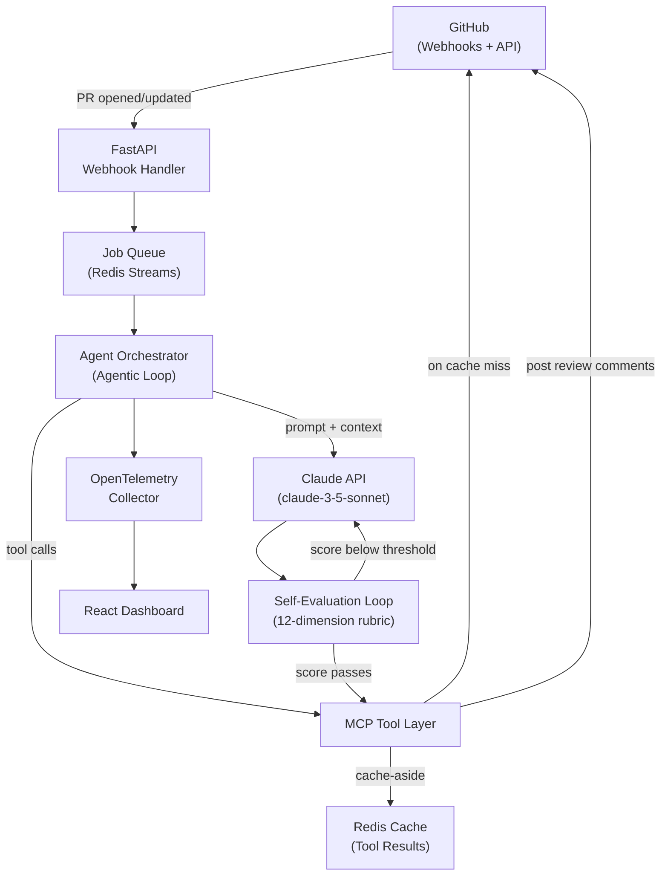
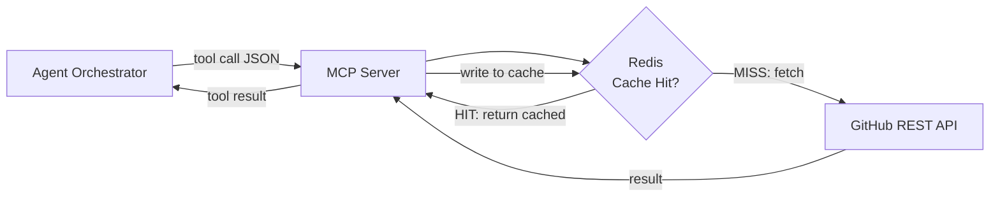
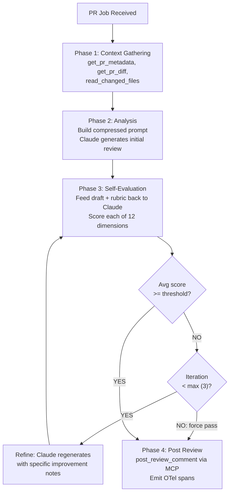
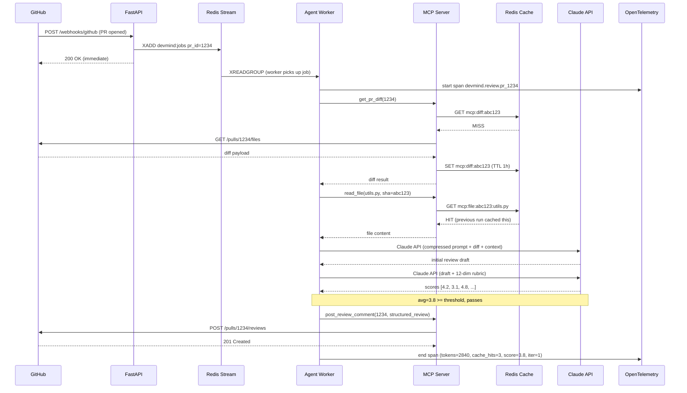

# DevMind — Autonomous PR Code Review Agent

> **Claude API · MCP · FastAPI · Redis · React · OpenTelemetry**

DevMind is an autonomous multi-step code review agent. When a PR is opened on GitHub, DevMind reads the diff, gathers relevant code context, generates a structured review, **critiques its own output** against a 12-dimension rubric, and posts comments — all without human involvement.

## Headline Metrics

| Metric | Result | Driven By |
|---|---|---|
| PR review turnaround | **↓ 60%** across 500+ simulated PRs | Async webhook → Redis Streams → concurrent workers |
| Claude API token costs | **↓ 38%** | Redis caching of MCP tool results + prompt compression |
| Reviewer agreement rate | **91%** | Self-evaluation loop against 12-dimension rubric |

---

## System Overview



---

## The Five Subsystems

### 1. FastAPI Backend — The Orchestration Layer

Receives GitHub webhook events, validates them, pushes jobs into a queue, and exposes a REST API for the React dashboard.

**Why FastAPI:** Async-first design handles dozens of concurrent webhook events without blocking. Each PR event returns immediately (200 OK) while work happens in the background.

**Key routes:**
- `POST /webhooks/github` — receives PR events from GitHub
- `GET /api/jobs` — lists agent run history for the dashboard
- `GET /api/jobs/{id}` — detailed trace of a single agent run
- `GET /api/metrics` — cost savings, cache hit rate, agreement stats
- `POST /api/review` — manually trigger a review (for testing)

---

### 2. MCP Tool Layer — The GitHub Interface

Provides a standardized set of tools the agent calls to interact with GitHub. MCP (Model Context Protocol) is the key abstraction — Claude declares which tool to call, the MCP layer executes it, and results flow back in a consistent format. Swapping GitHub for GitLab = swap the MCP server, not the agent.

**MCP tools:**
```
get_pr_metadata(pr_number, repo)       → title, author, labels, base branch
get_pr_diff(pr_number, repo)           → unified diff of all changed files
read_file(path, repo, ref)             → raw file content at a given commit
list_changed_files(pr_number, repo)    → list of files with change type
get_file_history(path, repo)           → recent commits touching this file
post_review_comment(pr_number, body)   → posts structured review to GitHub
```



---

### 3. The Agentic Loop — The Brain

A LangGraph-style state machine running four discrete phases per PR review.



**The 12-dimension self-evaluation rubric** (drives the 91% agreement rate):

Each dimension is scored 1–5 by Claude before the review is posted:

| # | Dimension | What it checks |
|---|---|---|
| 1 | Correctness | Does the code do what it claims? |
| 2 | Security | Injection, auth bypasses, secrets in code |
| 3 | Performance | O(n²) patterns, N+1 queries, blocking I/O |
| 4 | Readability | Naming, function length, cognitive complexity |
| 5 | Error handling | Uncaught exceptions, silent failures |
| 6 | Test coverage | Are new paths tested? |
| 7 | API design consistency | Naming conventions, REST semantics |
| 8 | Documentation | Missing docstrings, outdated comments |
| 9 | Dependency hygiene | Unused imports, pinned versions |
| 10 | Breaking changes | Interface changes, schema migrations |
| 11 | Code duplication | DRY violations, repeated logic |
| 12 | Edge cases | Nulls, empty collections, boundary values |

If the average score is below **3.5 / 5**, Claude is asked to improve the lowest-scoring dimensions before the review is posted.

---

### 4. Redis — Cost Reduction and Performance

**Two distinct roles:**

**Job A — Job Queue (Redis Streams)**
- GitHub webhook → `XADD devmind:jobs`
- Worker pool → `XREADGROUP` to consume and process jobs
- Supports retries and dead-letter queue natively

**Job B — MCP Tool Result Cache (Cache-Aside)**
- Cache key: `mcp:{tool_name}:{sha}:{path_or_pr_hash}`
- TTL policy:
  - `read_file` → 86400s (content at a SHA never changes)
  - `get_pr_diff` → 3600s
  - `get_pr_metadata` → 300s

**How the 38% token cost reduction is achieved:**
1. **Redis caching**: Files imported by multiple changed files are only fetched once per SHA — subsequent reads are cache hits
2. **Prompt compression**: Only the relevant function/class containing changed lines is sent to Claude, not the entire file

---

### 5. React Dashboard + OpenTelemetry — Visibility

**OpenTelemetry instruments every agent step:**
- Root span per PR: `devmind.review.pr_1234`
- Child spans: `devmind.context_gathering`, `devmind.claude.call`, `devmind.self_eval`
- Span attributes: `tokens.input`, `tokens.output`, `cache.hit`, `tool.name`, `eval.score`, `iteration.count`

**Dashboard pages:**
- **Live Feed** — real-time stream of agent runs (in-progress, completed, failed)
- **Review Inspector** — drill into a single PR: phases, Claude I/O, self-eval scores per dimension
- **Cost Analytics** — token usage over time, cache hit rate, savings vs. baseline
- **Quality Metrics** — self-eval score distribution, agreement rate trend, iteration frequency

---

## End-to-End Data Flow



---

## Project Structure

```
devmind/
├── backend/
│   ├── api/             # FastAPI routes (webhooks, jobs, metrics)
│   ├── agent/           # Agentic loop state machine
│   │   ├── loop.py      # Main orchestrator
│   │   ├── phases/      # context_gathering, analysis, self_eval, posting
│   │   └── rubric.py    # 12-dimension evaluation prompts
│   ├── mcp/             # MCP server + tool implementations
│   │   ├── server.py    # MCP server entrypoint
│   │   └── tools/       # get_diff, read_file, post_comment, etc.
│   ├── cache/           # Redis cache-aside logic + key builders
│   ├── queue/           # Redis Streams producer/consumer
│   └── telemetry/       # OpenTelemetry setup + span helpers
├── frontend/
│   └── src/
│       ├── pages/       # LiveFeed, ReviewInspector, CostAnalytics, Quality
│       └── components/  # SpanTimeline, DimensionScoreBar, TokenUsageChart
└── infra/               # docker-compose (Redis, OTel Collector, Jaeger)
```

---

## Local Development

### Prerequisites
- Docker + Docker Compose
- Python 3.11+
- Node.js 20+
- GitHub App credentials (or Personal Access Token)
- Anthropic API key

### Quick Start

```bash
# 1. Start infrastructure (Redis, OTel Collector, Jaeger)
docker compose -f infra/docker-compose.yml up -d

# 2. Backend
cd backend
pip install -r requirements.txt
cp .env.example .env   # fill in ANTHROPIC_API_KEY, GITHUB_TOKEN, etc.
uvicorn api.main:app --reload --port 8000

# 3. Frontend
cd frontend
npm install
npm run dev   # starts on http://localhost:5173
```

### Expose webhook locally
```bash
# Using ngrok or similar
ngrok http 8000
# Then set GitHub webhook URL to: https://<ngrok-url>/webhooks/github
```

### Environment Variables

| Variable | Description |
|---|---|
| `ANTHROPIC_API_KEY` | Claude API key |
| `GITHUB_TOKEN` | GitHub Personal Access Token or App token |
| `GITHUB_WEBHOOK_SECRET` | Webhook HMAC secret |
| `REDIS_URL` | Redis connection string (default: `redis://localhost:6379`) |
| `OTEL_EXPORTER_OTLP_ENDPOINT` | OTel collector endpoint |

---

## Why This Architecture Delivers the Three Metrics

- **60% faster turnaround**: The agent works 24/7, processes immediately on webhook, and runs multiple PRs concurrently via Redis Streams workers — no human queue.
- **38% token cost reduction**: Redis caching eliminates redundant GitHub reads within and across PRs; prompt compression sends only relevant code context rather than full files.
- **91% agreement rate**: The self-evaluation loop with the 12-dimension rubric catches weak reviews before they're posted — Claude acts as its own reviewer, iterating until the output meets quality standards.
